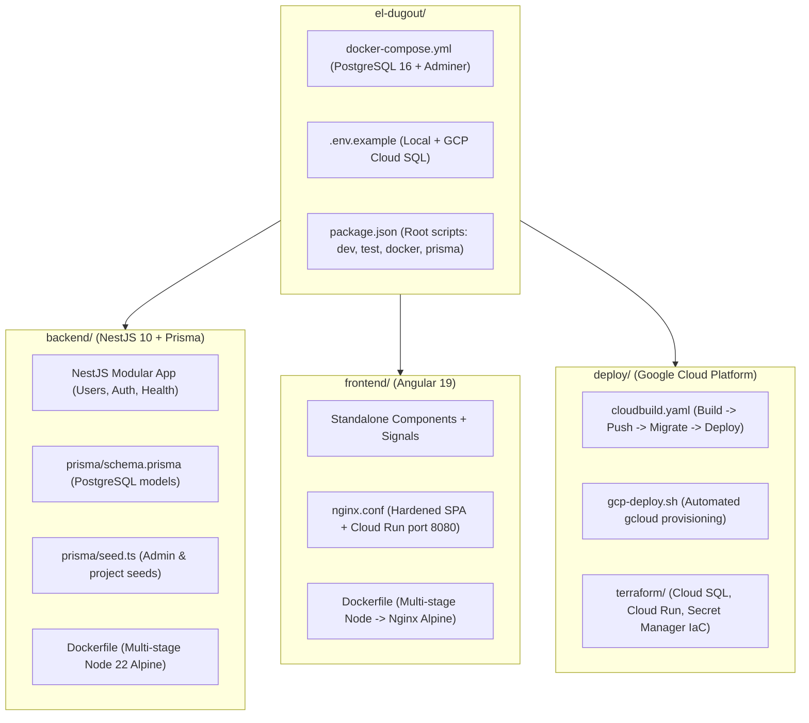

# Walkthrough: El Dugout Ve (Angular + NestJS + PostgreSQL / Google Cloud)

We have created the full architecture and codebase for **El Dugout Ve** (Venezuelan Professional Baseball Wiki) designed for Google Cloud Platform.

---

## 🏛 What Was Built

---

## 📁 Summary of Files Created

### 1. Root & Orchestration
- [docker-compose.yml](file:///Users/gabo/repos/el-dugout/docker-compose.yml): Local PostgreSQL 16 Alpine container with healthchecks and Adminer web GUI on `localhost:8081`.
- [.env.example](file:///Users/gabo/repos/el-dugout/.env.example): Complete environment variable template with local Postgres and Google Cloud SQL Unix socket configuration.
- [package.json](file:///Users/gabo/repos/el-dugout/package.json): Root scripts for running backend, frontend, database, prisma, and builds with a single command.
- [.gitignore](file:///Users/gabo/repos/el-dugout/.gitignore): Comprehensive ignores for Node, Angular cache, build outputs, terraform, and secrets.
- [README.md](file:///Users/gabo/repos/el-dugout/README.md): Detailed onboarding and architecture documentation.

### 2. Backend (`backend/`)
- [schema.prisma](file:///Users/gabo/repos/el-dugout/backend/prisma/schema.prisma): PostgreSQL datasource, User and Project relational models with audit timestamps (`createdAt`, `updatedAt`).
- [seed.ts](file:///Users/gabo/repos/el-dugout/backend/prisma/seed.ts): Seed script creating default admin user with hashed password and initial projects.
- [main.ts](file:///Users/gabo/repos/el-dugout/backend/src/main.ts): Bootstrap with Swagger/OpenAPI (`/api/docs`), global validation pipe, CORS, and Cloud Run host binding (`0.0.0.0`).
- [app.module.ts](file:///Users/gabo/repos/el-dugout/backend/src/app.module.ts): Clean modular composition.
- [prisma.service.ts](file:///Users/gabo/repos/el-dugout/backend/src/database/prisma.service.ts): Prisma client lifecycle management and Cloud SQL resilience.
- [health.controller.ts](file:///Users/gabo/repos/el-dugout/backend/src/modules/health/health.controller.ts): Liveness/readiness probe (`/api/health`) checking memory heap and PostgreSQL connectivity.
- [users.controller.ts](file:///Users/gabo/repos/el-dugout/backend/src/modules/users/users.controller.ts) & [users.service.ts](file:///Users/gabo/repos/el-dugout/backend/src/modules/users/users.service.ts): Full CRUD module with DTO validation.
- [auth.controller.ts](file:///Users/gabo/repos/el-dugout/backend/src/modules/auth/auth.controller.ts): Authentication starter with bcrypt verification.
- [Dockerfile](file:///Users/gabo/repos/el-dugout/backend/Dockerfile): Multi-stage slim production build running under an unprivileged user.

### 3. Frontend (`frontend/`)
- [angular.json](file:///Users/gabo/repos/el-dugout/frontend/angular.json): Modern `@angular/build:application` builder configuration.
- [app.config.ts](file:///Users/gabo/repos/el-dugout/frontend/src/app/app.config.ts): Modern standalone configuration with functional HTTP interceptor (`apiInterceptor`).
- [home.component.ts](file:///Users/gabo/repos/el-dugout/frontend/src/app/features/home/home.component.ts): Interactive dashboard with real-time health indicator for NestJS & PostgreSQL.
- [users.component.ts](file:///Users/gabo/repos/el-dugout/frontend/src/app/features/users/users.component.ts): Real-time user management with Angular Signals and CRUD operations.
- [architecture.component.ts](file:///Users/gabo/repos/el-dugout/frontend/src/app/features/architecture/architecture.component.ts): Visual GCP deployment topology diagram and architecture breakdown.
- [nginx.conf](file:///Users/gabo/repos/el-dugout/frontend/nginx.conf): Nginx configuration for Cloud Run with SPA routing fallback and security headers.
- [Dockerfile](file:///Users/gabo/repos/el-dugout/frontend/Dockerfile): Multi-stage Node build -> Nginx Alpine serving container (<25MB).

### 4. Deployment & Google Cloud Platform (`deploy/`)
- [cloudbuild.yaml](file:///Users/gabo/repos/el-dugout/deploy/cloudbuild.yaml): Complete CI/CD pipeline building Docker images, pushing to Google Artifact Registry, and deploying to Cloud Run.
- [gcp-deploy.sh](file:///Users/gabo/repos/el-dugout/deploy/gcp-deploy.sh): Automated `gcloud` provisioning script for Cloud SQL (PostgreSQL 16), Secret Manager, Artifact Registry, and Cloud Run.
- [terraform/](file:///Users/gabo/repos/el-dugout/deploy/terraform/): Complete Terraform configuration for Infrastructure as Code.

---

## 🧪 Live Execution & Issues Resolved

All four commands were executed, verified, and running:

1. **`npm run docker:db`**
   - *Issue Identified*: The host machine had native PostgreSQL services running on port `5432` (Homebrew) and `5433` (EnterpriseDB), preventing Docker from binding or routing traffic to the container.
   - *Fix Applied*: Configured `POSTGRES_PORT=5435` in [.env](file:///Users/gabo/repos/el-dugout/.env) and [.env.example](file:///Users/gabo/repos/el-dugout/.env.example). Removed obsolete `version: '3.8'` in [docker-compose.yml](file:///Users/gabo/repos/el-dugout/docker-compose.yml).
   - *Result*: `fullstack_postgres` and `fullstack_adminer` (port 8081) are active and healthy.

2. **`npm run prisma:migrate` & `npm run prisma:seed`**
   - *Issue Identified*: Headless migration would prompt for a migration name on fresh schemas.
   - *Fix Applied*: Updated backend script to `prisma migrate dev --name init`.
   - *Result*: Applied migration `20260904160310_init` and successfully seeded `admin@example.com` with sample projects.

3. **`npm run dev:backend`**
   - *Status*: Running in background at `http://localhost:3000/api`.
   - *Verified*:
     - `GET /api/health` -> `200 OK` (Memory heap: `up`, Database: `up`)
     - `GET /api/users` -> `200 OK` (Returns seeded user and projects)
     - Swagger UI available at `http://localhost:3000/api/docs`.

4. **`npm run dev:frontend`**
   - *Status*: Running in background at `http://localhost:4200/`.
   - *Verified*:
     - `GET /` -> `200 OK` with Angular 19 bundle and HMR enabled.

---

## ⚡ Active Services Overview

| Service | Address | Description |
| :--- | :--- | :--- |
| **Frontend** | [http://localhost:4200](http://localhost:4200) | Angular 19 SPA (Dashboard, Users, Architecture) |
| **Backend API** | [http://localhost:3000/api](http://localhost:3000/api) | NestJS REST API |
| **Swagger Docs** | [http://localhost:3000/api/docs](http://localhost:3000/api/docs) | Interactive OpenAPI Documentation |
| **Health Probe** | [http://localhost:3000/api/health](http://localhost:3000/api/health) | Terminus Liveness/Readiness Probe |
| **Adminer DB GUI** | [http://localhost:8081](http://localhost:8081) | Web interface for PostgreSQL |
| **PostgreSQL** | `localhost:5435` | Managed local PostgreSQL 16 container |
