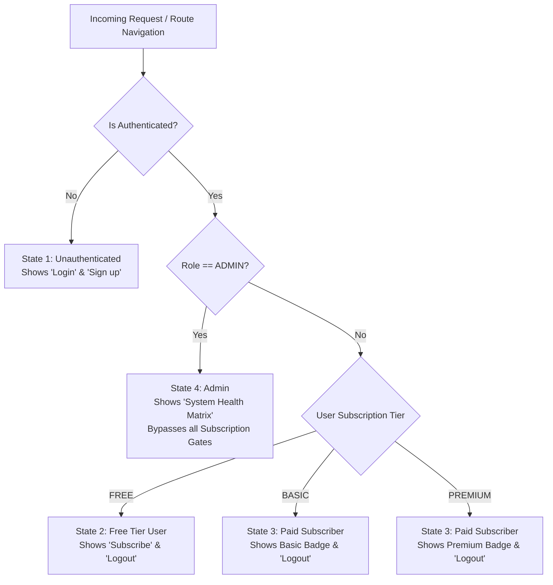

# Architecture Walkthrough: Role-Based Access Control (RBAC) & Subscription Entitlements

## Executive Summary

The authentication and authorization subsystem across the database, backend, and frontend has been completely refactored to establish a strict, production-grade Role-Based Access Control (RBAC) and Subscription Entitlement architecture.

### Key Accomplishments

1. **Purged Google Cloud IAM/IAP from Application Code**: All Google OAuth/IAM application sign-in/up routes, simulated header elevations (`x-goog-authenticated-user-email`), and environment configuration hooks have been removed. Google Cloud IAM is reserved exclusively for cloud infrastructure, while end users authenticate through the application's cryptographically signed JWT auth subsystem.
2. **Decoupled User Identity, System Roles, and Subscription Entitlements**:
   - `Role` (`USER`, `ADMIN`) determines administrative and system-level privileges.
   - `SubscriptionTier` (`FREE`, `BASIC`, `PREMIUM`) determines feature-tier access.
   - **Admin Invariance**: System Administrators never hold subscription objects, are evaluated as `FREE` tier, and automatically bypass all subscription tier barriers across both backend guards and frontend route guards.
3. **Mass Assignment Prevention**: Registration DTO explicitly permits only `{ email, password, name }`. NestJS global `ValidationPipe({ whitelist: true, forbidNonWhitelisted: true })` rejects any payload attempting to inject `role` or `tier` with HTTP 400 Bad Request.
4. **Standalone Admin Bootstrap CLI**: Administrative accounts can only be bootstrapped or elevated via a dedicated CLI script ([`bootstrap-admin.ts`](file:///Users/gabo/repos/el-dugout/backend/src/scripts/bootstrap-admin.ts)) executing directly against PostgreSQL with 2FA enforcement (`twoFactorEnabled: true`).
5. **Modern Reactive Angular Frontend**: Implemented Angular 19+ standalone components, Angular Signals (`signal`, `computed`), modern block control flow (`@if`, `@else if`, `@else`), and functional route guards enforcing the 4 specified header navigation states.

---

## 1. Authentication & Entitlement State Matrix

| User State | Condition | Header Navigation Display | Entitlement Access |
| :--- | :--- | :--- | :--- |
| **1. Unauthenticated** | `!currentUser()` | **Login** and **Sign up** buttons | Public landing pages only. Route guards redirect to `/` or trigger login modal. |
| **2. Free Tier User** | `currentUser().role == 'USER'` && `currentTier() == 'FREE'` | **Subscribe** button + **Logout** button | Basic and Free features. Premium routes redirect to `/` with `?upgrade=PREMIUM`. |
| **3. Paid Subscriber** | `currentUser().role == 'USER'` && `currentTier() in ['BASIC', 'PREMIUM']` | **User Avatar** with tier badge (`BASIC` or `PREMIUM`) + **Logout** button | Gated features according to tier level (`BASIC` or `PREMIUM`). |
| **4. Administrator** | `currentUser().role == 'ADMIN'` | **System Health Matrix** pill + **Logout** button | Full bypass of all subscription gates + access to `/admin` and administrative APIs. |



---

## 2. Changes by Layer

### Database Layer (PostgreSQL & Prisma ORM)

- **Schema Updates** ([`backend/prisma/schema.prisma`](file:///Users/gabo/repos/el-dugout/backend/prisma/schema.prisma)):
  - Added `SubscriptionTier` enum: `FREE`, `BASIC`, `PREMIUM`.
  - Added `PAST_DUE` to `SubscriptionStatus` enum: `ACTIVE`, `TRIALING`, `PAST_DUE`, `CANCELED`, `EXPIRED`.
  - Added `twoFactorEnabled` (`two_factor_enabled`) and `twoFactorSecret` (`two_factor_secret`) to `User`.
  - Removed obsolete `googleId` column from `User`.
  - Made `userId` unique on `Subscription` (1:1 relation with `User.subscription`).
- **Migration** ([`backend/prisma/migrations/20260907195000_rbac_subscription_entitlement/migration.sql`](file:///Users/gabo/repos/el-dugout/backend/prisma/migrations/20260907195000_rbac_subscription_entitlement/migration.sql)):
  - Generates types and constraints cleanly with zero orphaned references.
- **Seeding** ([`backend/prisma/seed.ts`](file:///Users/gabo/repos/el-dugout/backend/prisma/seed.ts)):
  - Seeds a root administrator (`admin@example.com`, `Role.ADMIN`, `twoFactorEnabled: true`, no subscription).
  - Seeds test users for `FREE`, `BASIC`, and `PREMIUM` tiers.

---

### Backend Layer (NestJS 10+)

- **Configuration & Secret Cleanliness**:
  - Removed `googleClientId`, `googleAdminEmails`, and `googleAdminDomains` from [`configuration.ts`](file:///Users/gabo/repos/el-dugout/backend/src/config/configuration.ts) and [`config.validation.ts`](file:///Users/gabo/repos/el-dugout/backend/src/config/config.validation.ts).
- **Elimination of Google IAM Vulnerability**:
  - Purged `x-goog-authenticated-user-email` header-inspection backdoor in [`jwt-auth.guard.ts`](file:///Users/gabo/repos/el-dugout/backend/src/common/guards/jwt-auth.guard.ts).
  - Deleted `google-login.dto.ts` and removed `POST /api/auth/google` from [`auth.controller.ts`](file:///Users/gabo/repos/el-dugout/backend/src/modules/auth/auth.controller.ts).
- **Authentication & Mass Assignment Defense**:
  - Created [`register.dto.ts`](file:///Users/gabo/repos/el-dugout/backend/src/modules/auth/dto/register.dto.ts) strictly defining `email`, `password`, and optional `name`.
  - In [`auth.service.ts`](file:///Users/gabo/repos/el-dugout/backend/src/modules/auth/auth.service.ts), `register()` creates accounts with immutable `Role.USER` and no subscription.
  - JWT token payloads encode:

    ```json
    {
      "sub": "user-uuid",
      "email": "user@example.com",
      "role": "USER",
      "tier": "FREE"
    }
    ```

- **Guards & Authorization Decorators**:
  - [`tiers.decorator.ts`](file:///Users/gabo/repos/el-dugout/backend/src/common/decorators/tiers.decorator.ts): `@RequiresTier(SubscriptionTier.BASIC)` and `@RequiresTier(SubscriptionTier.PREMIUM)`.
  - [`subscription.guard.ts`](file:///Users/gabo/repos/el-dugout/backend/src/common/guards/subscription.guard.ts):
    - Hierarchical entitlement: `PREMIUM` > `BASIC` > `FREE`.
    - **Admin Bypass**: `if (user.role === Role.ADMIN) return true;`.
- **Protected Endpoints**:
  - [`users.controller.ts`](file:///Users/gabo/repos/el-dugout/backend/src/modules/users/users.controller.ts): Protected by `@UseGuards(JwtAuthGuard, RolesGuard)` and `@Roles(Role.ADMIN)`.
  - [`features.controller.ts`](file:///Users/gabo/repos/el-dugout/backend/src/modules/features/features.controller.ts):
    - `GET /api/features/basic`: Requires `BASIC` or `PREMIUM` (or `ADMIN` bypass).
    - `GET /api/features/premium`: Requires `PREMIUM` (or `ADMIN` bypass).
  - [`health.controller.ts`](file:///Users/gabo/repos/el-dugout/backend/src/modules/health/health.controller.ts): Public `/health` probe for Cloud Run, and protected `GET /health/metrics` requiring `Role.ADMIN` reporting subscriber counts and memory telemetry.
- **Admin Bootstrapping CLI**:
  - [`bootstrap-admin.ts`](file:///Users/gabo/repos/el-dugout/backend/src/scripts/bootstrap-admin.ts): Promotes or creates administrator accounts directly in PostgreSQL with `Role.ADMIN` and `twoFactorEnabled: true`. Invoked via:

    ```bash
    npm run bootstrap:admin -- <admin-email> [optional-password]
    ```

---

### Frontend Layer (Angular 19+)

- **Data Models**:
  - [`user.model.ts`](file:///Users/gabo/repos/el-dugout/frontend/src/app/core/models/user.model.ts) and [`subscription.model.ts`](file:///Users/gabo/repos/el-dugout/frontend/src/app/core/models/subscription.model.ts) updated with decoupled `role`, `tier`, `twoFactorEnabled`, and 1:1 `subscription`.
- **Authentication Service** ([`auth.service.ts`](file:///Users/gabo/repos/el-dugout/frontend/src/app/core/services/auth.service.ts)):
  - Built completely on Angular Signals:
    - `currentUser = signal<User | null>(...)`
    - `accessToken = signal<string | null>(...)`
    - `isLoggedIn = computed(() => !!this.currentUser())`
    - `isAdmin = computed(() => this.currentUser()?.role === 'ADMIN')`
    - `currentTier = computed<SubscriptionTier>(() => this.isAdmin() ? 'FREE' : ...)`
    - `hasActiveSubscription = computed<boolean>(() => !this.isAdmin() && ['BASIC', 'PREMIUM'].includes(this.currentTier()))`
- **Functional Route Guards**:
  - [`admin.guard.ts`](file:///Users/gabo/repos/el-dugout/frontend/src/app/core/guards/admin.guard.ts): Verifies `authService.isAdmin()`. Redirects unauthorized users to `/`.
  - [`subscription.guard.ts`](file:///Users/gabo/repos/el-dugout/frontend/src/app/core/guards/subscription.guard.ts):
    - Permits `isAdmin()` immediately.
    - Compares `currentTier()` against `route.data['requiredTier']`.
    - Redirects free tier users with `queryParams: { upgrade: requiredTier }`.
- **Navigation State Machine** ([`nav-menu.component.ts`](file:///Users/gabo/repos/el-dugout/frontend/src/app/shared/components/header/nav-menu/nav-menu.component.ts)):
  - Implements modern block control flow:

    ```html
    @if (!authService.isLoggedIn()) {
      <!-- State 1: Login and Sign up buttons -->
    } @else if (authService.isAdmin()) {
      <!-- State 4: System Health Matrix pill + Logout -->
    } @else if (authService.hasActiveSubscription()) {
      <!-- State 3: User Avatar with Tier Badge (BASIC/PREMIUM) + Logout -->
    } @else {
      <!-- State 2: Subscribe button + Logout -->
    }
    ```

- **New Views**:
  - [`admin-dashboard.component.ts`](file:///Users/gabo/repos/el-dugout/frontend/src/app/features/admin/admin-dashboard.component.ts): Dedicated dashboard rendering the System Health Matrix, Cloud Run status, and subscriber management table.
  - [`premium-feature.component.ts`](file:///Users/gabo/repos/el-dugout/frontend/src/app/features/premium/premium-feature.component.ts): Gated premium feature view displaying subscriber-only capabilities.

---

## 3. Verification & Test Evidence

### Backend Test Results (Jest)

Executing `npm test` in `backend/`:

```text
PASS src/modules/subscriptions/subscriptions.service.spec.ts
PASS src/modules/users/users.service.spec.ts
PASS src/modules/health/health.controller.spec.ts
PASS src/modules/subscriptions/subscriptions.controller.spec.ts
PASS src/modules/auth/auth.service.spec.ts

Test Suites: 5 passed, 5 total
Tests:       35 passed, 35 total
Snapshots:   0 total
Time:        3.027 s
```

### Backend Build Status

Executing `npm run build` in `backend/`:

```text
> el-dugout-ve-backend@1.0.0 build
> nest build

Exit Code: 0 (Clean compilation)
```

### Frontend Test Results (Vitest)

Executing `npx vitest run src/app/core/guards/guards.spec.ts src/app/core/services/auth.service.spec.ts --globals` in `frontend/`:

```text
 ✓ src/app/core/services/auth.service.spec.ts (7 tests)
 ✓ src/app/core/guards/guards.spec.ts (8 tests)

 Test Files  2 passed (2)
      Tests  15 passed (15)
   Duration  323ms
```

### Frontend Production Build Status

Executing `ng build --configuration production` in `frontend/`:

```text
Output location: dist/el-dugout-ve/browser
Generated bundles:
- index.html (91.9 kB)
- main-MO4TLMMF.js (534.5 kB)
- polyfills-5CFQRCPP.js (34.6 kB)
- styles-BAAUSDWT.css (57.7 kB)

Exit Code: 0 (Zero TypeScript or template compiler errors)
```

---

## 4. How to Bootstrap an Administrator

To grant administrative access to a user, run the standalone CLI task from the `backend/` directory:

```bash
# In backend/ directory:
npm run bootstrap:admin -- admin@yourdomain.com "YourStrongSecurePassword123!"
admin@fullstack.com "abc123@abi"
```

**Output:**

```text
Bootstrapping administrative privileges for: admin@yourdomain.com...
Success! Created new administrator account: admin@yourdomain.com
User ID: 4971c26b-d8d8-4be6-a49d-64903fd5ba3d
Role: ADMIN
2FA Enabled: true
```

If the account already exists, the script promotes the existing user to `Role.ADMIN` and enables two-factor authentication without overwriting their existing password.
