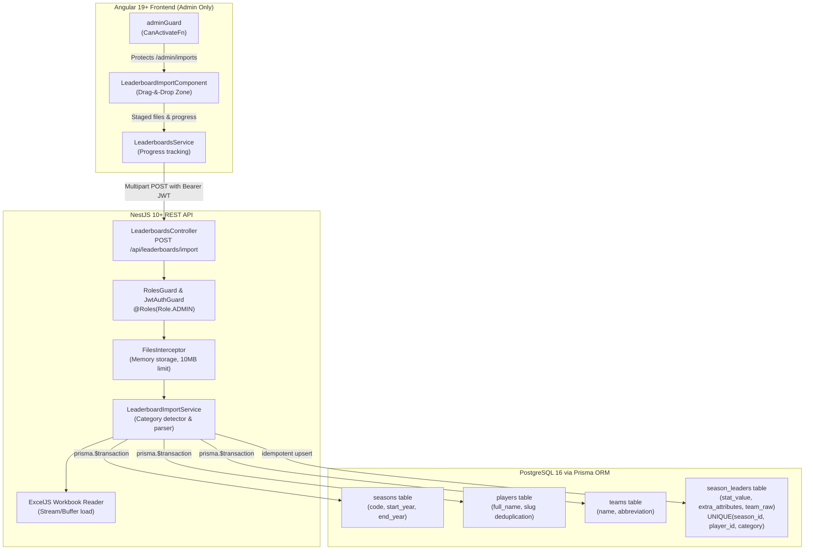

# Walkthrough: LVBP Historical Leaderboards Ingestion Architecture

We have designed and implemented an end-to-end ingestion system for LVBP historical leaderboards (spanning 1946 to 2026), based on [`docs/data-base-init.md`](file:///Users/gabo/repos/el-dugout/docs/data-base-init.md). The feature is **strictly restricted to admin users** across both the backend API and the Angular frontend.

---

## Architecture Overview



---

## 1. Database Schema Design (PostgreSQL & Prisma)

Updated [`backend/prisma/schema.prisma`](file:///Users/gabo/repos/el-dugout/backend/prisma/schema.prisma) following workspace standards (UUID primary keys, audit timestamps, and snake_case PostgreSQL column/table mappings):

- **`StatCategory` Enum**:
  - `BATTING_AVERAGE`, `HITS`, `DOUBLES`, `TRIPLES`, `HOME_RUNS`, `RUNS`.
- **`Season` (`seasons`)**:
  - `id`: UUID primary key.
  - `code`: unique string (`"1946-46"`, `"1946-47"`, `"2025-26"`).
  - `startYear`, `endYear`: numeric bounds.
- **`Team` (`teams`)**:
  - `id`: UUID primary key.
  - `name`: unique team name (e.g. `"Leones del Caracas"`, `"Navegantes del Magallanes"`).
  - `abbreviation`: short code (`"CAR"`, `"MAG"`).
- **`Player` (`players`)**:
  - `id`: UUID primary key.
  - `fullName`: full display name (e.g. `"Jesús Ramos"`).
  - `slug`: unique URL-safe slug generated via accent-insensitive normalization (`"jesus-ramos"`).
- **`SeasonLeader` (`season_leaders`)**:
  - `id`: UUID primary key.
  - `seasonId` & `playerId`: foreign keys with cascading delete.
  - `teamRaw`: string retaining raw split-team labels (`"Ara-Zul"`, `"MAG-ANZ"`).
  - `teamId`: nullable foreign key to canonical `teams`.
  - `category`: `StatCategory` enum.
  - `statValue`: `Decimal(6, 3)` supporting both integer counters (e.g. 48 hits) and batting averages (e.g. 0.403).
  - `extraAttributes`: JSONB capturing contextual columns (`jj`, `vb`, `h` from batting average sheets).
  - `@@unique([seasonId, playerId, category])`: allows simultaneous ties across multiple players in the same season, while ensuring re-uploads are 100% idempotent.

---

## 2. Backend Upload & Ingestion Architecture (NestJS)

### Key Files Created
- [`leaderboard-import.service.ts`](file:///Users/gabo/repos/el-dugout/backend/src/modules/leaderboards/leaderboard-import.service.ts):
  - **Category Auto-Detection**: inspects workbook filenames (`lider-bate`, `lider-hits`, `lider-dobles`, `lider-triples`, `lider-homerun`, `lider-anotadas`) and header columns (`avg`, `hr`, `d`, `total`, `h`, `ca`).
  - **In-Memory Streaming**: uses `ExcelJS.Workbook.xlsx.load(file.buffer)` with no temporary disk files.
  - **Identity Deduplication**: strips Spanish accents (`stripAccents`) and formats player slugs.
  - **Atomic Transaction & Idempotency**: wraps database writes in `this.prisma.$transaction`, tracking created vs. updated records.
- [`leaderboards.controller.ts`](file:///Users/gabo/repos/el-dugout/backend/src/modules/leaderboards/leaderboards.controller.ts):
  - **Admin Restriction**: `@UseGuards(JwtAuthGuard, RolesGuard)` and `@Roles(Role.ADMIN)`.
  - **Multi-File Upload**: `@UseInterceptors(FilesInterceptor('files', 10, ...))` with MIME and extension checks (`.xlsx`, `.xls`).
  - **Swagger/OpenAPI Documentation**: `@ApiTags('Leaderboards')`, `@ApiBearerAuth()`, `@ApiConsumes('multipart/form-data')`.
  - **Query Endpoint**: `GET /api/leaderboards/leaders` supporting filters by category and season code with pagination.
- [`import-result.dto.ts`](file:///Users/gabo/repos/el-dugout/backend/src/modules/leaderboards/dto/import-result.dto.ts):
  - Response DTO detailing execution counts, inserted records, updated records, and per-file summaries.
- [`leaderboards.module.ts`](file:///Users/gabo/repos/el-dugout/backend/src/modules/leaderboards/leaderboards.module.ts):
  - Registered in [`backend/src/app.module.ts`](file:///Users/gabo/repos/el-dugout/backend/src/app.module.ts).

---

## 3. Frontend Controller & Drag-&-Drop Architecture (Angular 19+)

### Key Files Created & Modified
- [`leaderboards.service.ts`](file:///Users/gabo/repos/el-dugout/frontend/src/app/core/services/leaderboards.service.ts):
  - Handles `POST leaderboards/import` with `reportProgress: true` and `observe: 'events'` for upload progress streaming.
  - Provides instant client-side category preview (`detectCategoryPreview`).
- [`leaderboard-import.component.ts`](file:///Users/gabo/repos/el-dugout/frontend/src/app/features/admin/leaderboard-import/leaderboard-import.component.ts):
  - **Drag-&-Drop Zone**: animated hover boundary with pulse feedback, drop/dragover/dragleave handling.
  - **File Picker Fallback**: hidden input triggered by clicking or pressing Enter/Space.
  - **Client-Side Validation**: validates file extensions (`.xlsx`, `.xls`), 10MB file limit, and duplicate prevention.
  - **Staged Queue & Category Badges**: displays staged files with formatted file sizes (`KB`, `MB`), category chips, and delete buttons.
  - **Progress Tracking & Results Telemetry**: live progress bar, followed by a detailed telemetry card showing workbooks processed, new rows inserted, rows refreshed idempotently, and per-file results.
- [`app.routes.ts`](file:///Users/gabo/repos/el-dugout/frontend/src/app/app.routes.ts):
  - Registered `/admin/imports` child route lazy-loaded and protected by `adminGuard`.
- [`admin-dashboard.component.ts`](file:///Users/gabo/repos/el-dugout/frontend/src/app/features/admin/admin-dashboard.component.ts):
  - Added direct quick action: `⚾ Ingest Leaderboards` navigating to `/admin/imports`.

---

## 4. Verification & Testing Results

### Backend Automated Tests
Ran `npm test` in `backend/`:
```text
PASS src/modules/users/users.service.spec.ts
PASS src/modules/health/health.controller.spec.ts
PASS src/modules/subscriptions/subscriptions.service.spec.ts
PASS src/common/filters/all-exceptions.filter.spec.ts
PASS src/modules/subscriptions/subscriptions.controller.spec.ts
PASS src/modules/leaderboards/leaderboard-import.service.spec.ts
PASS src/modules/leaderboards/leaderboards.controller.spec.ts
PASS src/modules/auth/auth.service.spec.ts

Test Suites: 8 passed, 8 total
Tests:       68 passed, 68 total
Snapshots:   0 total
Time:        5.059 s
```

### Backend Production Build
Ran `npm run build` in `backend/`:
```text
> nest build
Exit code: 0 (Clean compilation)
```

### Frontend Automated Tests (Vitest)
Ran `npm run test` in `frontend/`:
```text
Test Files  16 passed (16)
Tests       126 passed (126)
Duration    1.64s
```
All 126 frontend unit tests passed, including:
- `LeaderboardsService`: category preview detection, progress reporting options, and query parameter serialization.
- `LeaderboardImportComponent`: drag-and-drop file additions, non-Excel validation rejection, staged file queue removal/clearing, upload progress updates, server error alerts, and admin permission checks.

---

## 5. PostgreSQL Table Validation & Live CRUD Verification

We deployed migration `20260923083000_add_leaderboards_and_records` to the running PostgreSQL container (`el_dugout_postgres`) and executed an end-to-end database verification script ([`backend/src/scripts/validate-leaderboard-tables.ts`](file:///Users/gabo/repos/el-dugout/backend/src/scripts/validate-leaderboard-tables.ts)) via `npm run test:db`.

### Results of Validation:
1. **Schema Existence (`information_schema.tables`)**:
   - `seasons`: confirmed present in schema `public`.
   - `teams`: confirmed present in schema `public`.
   - `players`: confirmed present in schema `public`.
   - `season_leaders`: confirmed present in schema `public`.

2. **Column & Data Type Inspection (`information_schema.columns`)**:
   - `seasons`: `id` (text, PK), `code` (text, unique), `start_year` (int), `end_year` (int), `created_at` (timestamp), `updated_at` (timestamp).
   - `teams`: `id` (text, PK), `name` (text, unique), `abbreviation` (text, nullable), `created_at`, `updated_at`.
   - `players`: `id` (text, PK), `full_name` (text), `slug` (text, unique), `created_at`, `updated_at`.
   - `season_leaders`: `id` (text, PK), `season_id` (text, FK), `player_id` (text, FK), `team_raw` (text), `team_id` (text, nullable FK), `category` (enum `StatCategory`), `stat_value` (numeric), `extra_attributes` (jsonb, default `{}`), `created_at`, `updated_at`.

3. **Index & Constraint Verification (`pg_indexes`)**:
   - `seasons_code_key`: unique B-tree index on `code`.
   - `teams_name_key`: unique B-tree index on `name`.
   - `players_slug_key`: unique B-tree index on `slug`.
   - `season_leaders_season_id_player_id_category_key`: composite unique B-tree index enforcing idempotency and preventing duplicate entries while supporting ties.
   - `season_leaders_category_season_id_idx`: query acceleration index on `(category, season_id)`.
   - `season_leaders_player_id_idx`: join acceleration index on `player_id`.

4. **Live CRUD & Integration Operations**:
   - Successfully inserted test records across `seasons`, `teams`, `players`, and `season_leaders`.
   - Successfully tested idempotent upsert modifying `stat_value` without violating constraints.
   - Successfully performed 4-table relational join (`SeasonLeader` with `Season`, `Player`, and `Team`).
   - Verified cascading delete (`ON DELETE CASCADE`): deleting the `Season` record cleanly and automatically deleted the linked `SeasonLeader` record.
