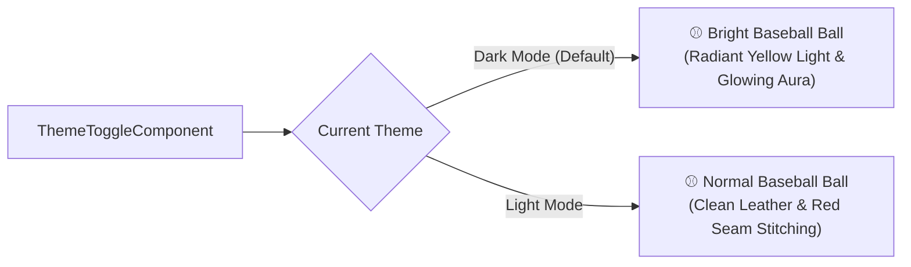

# Walkthrough: Baseball Theme System & Dual-Mode Baseball Toggle

We have implemented a comprehensive theme system for **El Dugout Ve**, featuring the official Venezuelan baseball design tokens, an Angular signal-based `ThemeService`, and an interactive **Baseball Ball toggle button** that behaves distinctly in Dark and Light modes.

---

## 🎨 Design Tokens & Color Palette

All color tokens in [`_theme.scss`](../el-dugout/frontend/src/styles/_theme.scss) and [`styles.scss`](../el-dugout/frontend/src/styles.scss) have been updated to reflect the baseball identity:

| Token Category | Dark Mode (Default) | Light Mode | Utility Classes |
| :--- | :--- | :--- | :--- |
| **Primary (Crimson Red)** | `#ef4444` (`text-red-500` / `bg-red-500`) | `#dc2626` (`text-red-600` / `bg-red-600`) | `.text-red-600`, `.bg-red-600`, `.text-red-500`, `.bg-red-500`, `.hover:bg-red-700` (`#b91c1c`) |
| **Secondary (Navy Blue)** | `#3b82f6` (`text-blue-400` / `bg-blue-600`) | `#1e3a8a` (`text-blue-900` / `bg-blue-900`) | `.text-blue-900`, `.bg-blue-900`, `.text-blue-400`, `.bg-blue-600`, `.bg-deep-navy` (`#0f172a`) |
| **Accent / Tertiary (Vintage Ochre)** | `#d97706` / `#b45309` (Trophies & Badges) | `#d97706` / `#b45309` | `.text-ochre`, `.bg-ochre`, `.text-ochre-dark`, `.badge-ochre`, `.trophy-accent` |
| **Canvas Background** | `#0b0f19` (Deep obsidian / black) | `#f8fafc` (Crisp gray-white) | `var(--bg-main)`, `var(--background-primary-color)` |
| **Cards & Containers** | `#111827` (Border: `#1f2937`) | `#ffffff` (Border: `#e2e8f0`) | `var(--bg-card)`, `var(--background-secondary-color)` |
| **High-Contrast Text** | `#f9fafb` (Off-white) | `#0f172a` (Deep slate) | `var(--text-primary)`, `var(--text-color)` |
| **Muted Text** | `#9ca3af` | `#64748b` | `var(--text-secondary)`, `var(--text-secondary-color)` |

---

## ⚾ Baseball Ball Toggle Button

The new [`ThemeToggleComponent`](../el-dugout/frontend/src/app/shared/components/header/theme-toggle/theme-toggle.component.ts) renders an authentic baseball SVG ball with dual behavior:



### 1. Dark Mode Behavior (Active)

- **Illumination**: The baseball is a **bright baseball ball emitting bright yellow light**.
- **Visuals**:
  - Radial gradient core transitioning from `#ffffff` and `#fef08a` to radiant `#facc15` and warm amber `#eab308`.
  - Multi-layer ambient yellow bloom: `drop-shadow(0 0 6px #facc15) drop-shadow(0 0 14px rgba(250, 204, 21, 0.85)) drop-shadow(0 0 22px rgba(234, 179, 8, 0.6))`.
  - Pulsing yellow beacon light rings surrounding the baseball.
  - Luminous light glint on the sphere.

### 2. Light Mode Behavior

- **Classic Ball**: Renders as a **normal baseball ball**.
- **Visuals**:
  - Crisp white/cream leather shading (`#ffffff` to `#f8fafc` to `#cbd5e1`).
  - Traditional curved baseball seams with red chevron stitches (`#dc2626` / `#b91c1c`).
  - Subtle natural 3D spherical shadow without yellow glow.

### 3. Tactile Feedback & Accessibility

- Click animation: 360-degree rotation and scale pulse.
- ARIA support: `role="switch"`, `aria-checked="true|false"`, `aria-label`, and keyboard focus ring.

---

## ⚙️ Core Theme Service

Created [`ThemeService`](../el-dugout/frontend/src/app/core/services/theme.service.ts):
- Uses Angular 19+ **Signals**: `theme()`, `isDark()`, `isLight()`.
- Persists user selection to `localStorage` under `el_dugout_theme`.
- Modifies `document.documentElement` (`class="dark|light"`, `data-theme="dark|light"`, `colorScheme="dark|light"`).
- SSR-safe execution with `isPlatformBrowser`.

---

## 🔍 Verification & Test Results

### 1. Automated Vitest Suite

Executed:
```bash
npm run test
```
Result: **12 test files passed, 89 total tests passed (100% success)**.
- `src/app/core/services/theme.service.spec.ts`: 4 passed (initialization, toggle, persistence, reload).
- `src/app/shared/components/header/theme-toggle/theme-toggle.component.spec.ts`: 4 passed (render, click toggle, spin animation, light/dark states).
- All 81 existing tests continue passing without regression.

### 2. Production Build Verification

Result: **Build completed successfully with exit code 0**. All SCSS and TypeScript bundles compiled without errors.
