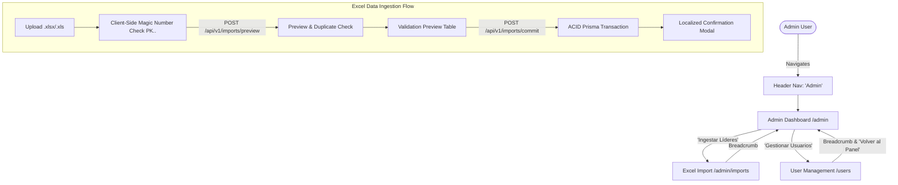

# Walkthrough: Secure Excel File Import & Validation Flow

We have implemented an end-to-end admin data ingestion feature for **El Dugout VE**, enabling administrators to upload Excel spreadsheets (`.xlsx`, `.xls`), perform strict client- and server-side threat mitigations, inspect parsed rows in a validation table with database duplicate conflict detection, and atomically commit clean records into PostgreSQL.

---

## 🚀 Recent Refinements & Admin Enhancements

### 1. Admin Theme System Configuration
- **Token Harmonization:** Aligned admin components with the global theme tokens (`--font-display`, `--font-sans`, `--background-secondary-color`, `--border-theme-color`, `--text-color`, `--text-secondary-color`, `--primary`, `--radius-md`).
- **Targeted Elements:**
  - [`.page-title`](file:///Users/gabo/repos/el-dugout/frontend/src/app/modules/admin/components/import-file/import-file.component.ts#L304-L311) & [`.page-subtitle`](file:///Users/gabo/repos/el-dugout/frontend/src/app/modules/admin/components/import-file/import-file.component.ts#L313-L320)
  - [`.dropzone-card`](file:///Users/gabo/repos/el-dugout/frontend/src/app/modules/admin/components/import-file/import-file.component.ts#L380-L400) (drag-and-drop area with theme card backgrounds and borders)
  - [`.breadcrumb-nav`](file:///Users/gabo/repos/el-dugout/frontend/src/app/modules/admin/components/import-file/import-file.component.ts#L253-L278) (breadcrumb trails and subtle dividers)
  - [`.data-table`](file:///Users/gabo/repos/el-dugout/frontend/src/app/modules/admin/components/validation-table/validation-table.component.ts#L480-L510) and [`.summary-card`](file:///Users/gabo/repos/el-dugout/frontend/src/app/modules/admin/components/validation-table/validation-table.component.ts#L394-L435)
  - Buttons (`.btn-outline`, `.btn-browse`, `.btn-primary`)

### 2. Confirmation Modal with Full i18n Support
- **Parameterized Localization:** Localized the confirmation dialog messages in [`confirmation-modal.component.ts`](file:///Users/gabo/repos/el-dugout/frontend/src/app/modules/admin/components/confirmation-modal/confirmation-modal.component.ts) using `TranslatePipe` and dynamic params:
  - `IMPORT_EXCEL.MODAL.SUCCESS_MESSAGE`: `"Se han procesado exitosamente {{ total }} registros ({{ inserted }} insertados, {{ updated }} actualizados)."`
  - `IMPORT_EXCEL.MODAL.ERROR_MESSAGE`: `"Ocurrió un error al procesar la importación. No se guardaron cambios en la base de datos."`
- **Dual-Asset Synchronization:** Added definitions across all four translation files:
  - [`frontend/src/assets/i18n/es.json`](file:///Users/gabo/repos/el-dugout/frontend/src/assets/i18n/es.json) & [`frontend/public/assets/i18n/es.json`](file:///Users/gabo/repos/el-dugout/frontend/public/assets/i18n/es.json)
  - [`frontend/src/assets/i18n/en.json`](file:///Users/gabo/repos/el-dugout/frontend/src/assets/i18n/en.json) & [`frontend/public/assets/i18n/en.json`](file:///Users/gabo/repos/el-dugout/frontend/public/assets/i18n/en.json)

### 3. User Management View (`/users`) Upgrades
- **Breadcrumbs:** Added breadcrumbs to [`UsersComponent`](file:///Users/gabo/repos/el-dugout/frontend/src/app/features/users/users.component.ts):
  - Dashboard (`/admin`) → Current view (`USERS.BREADCRUMB_CURRENT`).
- **Back to Dashboard Button:** Inserted a styled `btn-outline` link with `arrow_back` icon leading directly back to the Admin Dashboard (`/admin`).
- **Theming:** Integrated `.breadcrumb-nav` and `.header-actions` with display typography and theme color tokens.

### 4. Consolidated Main Navigation Menu
- **Simplified Nav:** Updated [`NavMenuComponent`](file:///Users/gabo/repos/el-dugout/frontend/src/app/shared/components/header/nav-menu/nav-menu.component.ts) to display a single top-level **Admin** link (`COMMON.NAV.ADMIN` -> `/admin`) when an admin user is logged in.
- **Removed Top-Level Clutter:** Removed direct links for "Manage Users" and "Excel Import" from the top navigation bar, routing admins directly through the centralized Admin Dashboard.

---

## 🛠 Architectural Overview



---

## 🧪 Verification Results

### 1. Frontend Unit Tests (`npm test` / Vitest)
```text
 ✓ src/app/modules/admin/components/confirmation-modal/confirmation-modal.component.spec.ts (4 tests)
 ✓ src/app/modules/admin/components/validation-table/validation-table.component.spec.ts (6 tests)
 ✓ src/app/modules/admin/components/import-file/import-file.component.spec.ts (10 tests)
 ✓ src/app/core/services/imports.service.spec.ts (7 tests)
 ...
 Test Files  23 passed (23)
      Tests  165 passed (165)
   Duration  2.92s
```

### 2. Backend Unit Tests (`npm test` / Jest)
```text
PASS src/modules/subscriptions/subscriptions.service.spec.ts
PASS src/common/filters/all-exceptions.filter.spec.ts
PASS src/modules/users/users.service.spec.ts
PASS src/modules/health/health.controller.spec.ts
PASS src/modules/subscriptions/subscriptions.controller.spec.ts
PASS src/modules/leaderboards/leaderboard-import.service.spec.ts
PASS src/modules/imports/imports.controller.spec.ts
PASS src/modules/leaderboards/leaderboards.controller.spec.ts
PASS src/modules/auth/auth.service.spec.ts

Test Suites: 9 passed, 9 total
Tests:       89 passed, 89 total
Snapshots:   0 total
Time:        5.497 s
```

### 3. Build & Compilation Verification
- **Frontend TypeScript (`tsc`):** `npx tsc -p tsconfig.app.json --noEmit` passed with 0 errors.
- **Frontend Build (`ng build`):** Clean production compilation.
- **Backend Build (`nest build`):** Clean compilation.
