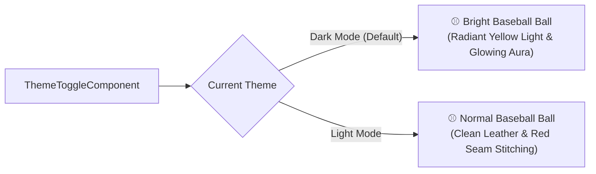

# Walkthrough: Baseball Theme System, Dual-Mode Toggle & Input Theme Alignment

We have implemented a comprehensive theme system for **El Dugout Ve**, featuring the official Venezuelan baseball design tokens, an Angular signal-based `ThemeService`, an interactive **Baseball Ball toggle button** that behaves distinctly in Dark and Light modes, custom Google Fonts typography, and complete theme alignment across all authentication and subscription forms and inputs.

---

## 🖋 Typography & Font Families (Google Fonts)

All fonts are imported from the **Google Fonts platform** in [`index.html`](file:///Users/gabo/repos/el-dugout/frontend/src/index.html) and wired to design tokens and global selectors in [`_theme.scss`](file:///Users/gabo/repos/el-dugout/frontend/src/styles/_theme.scss) and [`styles.scss`](file:///Users/gabo/repos/el-dugout/frontend/src/styles.scss):

```html
<link rel="preconnect" href="https://fonts.googleapis.com">
<link rel="preconnect" href="https://fonts.gstatic.com" crossorigin>
<link href="https://fonts.googleapis.com/css2?family=Bebas+Neue&family=Montserrat:ital,wght@0,300..800;1,300..800&family=Permanent+Marker&family=Pixelify+Sans:wght@400..700&display=swap" rel="stylesheet">
```

| Element / Usage | Font Family | CSS Variable / Utility Class | Description |
| :--- | :--- | :--- | :--- |
| **Header 1, 2 y 3** (`h1`, `h2`, `h3`) | **Bebas Neue** | `var(--font-heading)`, `var(--font-display)`, `.font-heading` | Iconic, punchy all-caps baseball stadium display font |
| **Header 4, normal text, buttons, links** | **Montserrat** | `var(--font-sans)`, `var(--font-primary)`, `.font-sans` | Clean, geometric, highly readable modern sans-serif |
| **Design font (Special text)** | **Permanent Marker** | `var(--font-design)`, `var(--font-special)`, `.font-design`, `.special-text` | Hand-drawn marker font for badges, autographs, and highlights |
| **Mono / Code** (`code`, `pre`) | **Pixelify Sans** | `var(--font-mono)`, `.font-mono` | Retro scoreboard / pixelated aesthetic for tech & boxscore numbers |

---

## 🎨 Design Tokens & Color Palette

All color tokens in [`_theme.scss`](file:///Users/gabo/repos/el-dugout/frontend/src/styles/_theme.scss) and [`styles.scss`](file:///Users/gabo/repos/el-dugout/frontend/src/styles.scss) reflect the baseball identity:

| Token Category | Dark Mode (Default) | Light Mode | Utility Classes |
| :--- | :--- | :--- | :--- |
| **Primary (Crimson Red)** | `#ef4444` (`text-red-500` / `bg-red-500`) | `#dc2626` (`text-red-600` / `bg-red-600`) | `.text-red-600`, `.bg-red-600`, `.text-red-500`, `.bg-red-500`, `.hover:bg-red-700` (`#b91c1c`) |
| **Secondary (Navy Blue)** | `#3b82f6` (`text-blue-400` / `bg-blue-600`) | `#1e3a8a` (`text-blue-900` / `bg-blue-900`) | `.text-blue-900`, `.bg-blue-900`, `.text-blue-400`, `.bg-blue-600`, `.bg-deep-navy` (`#0f172a`) |
| **Accent / Tertiary (Vintage Ochre)** | `#d97706` / `#b45309` (Trophies & Badges) | `#d97706` / `#b45309` | `.text-ochre`, `.bg-ochre`, `.text-ochre-dark`, `.badge-ochre`, `.trophy-accent` |
| **Canvas Background** | `#0b0f19` (Deep obsidian / black) | `#f8fafc` (Crisp gray-white) | `var(--bg-main)`, `var(--background-primary-color)` |
| **Cards & Containers** | `#111827` (Border: `#1f2937`) | `#ffffff` (Border: `#e2e8f0`) | `var(--bg-card)`, `var(--background-secondary-color)` |
| **High-Contrast Text** | `#f9fafb` (Off-white) | `#0f172a` (Deep slate) | `var(--text-primary)`, `var(--text-color)` |
| **Muted Text** | `#9ca3af` | `#64748b` | `var(--text-secondary)`, `var(--text-secondary-color)` |

---

## ⚾ Baseball Ball Toggle Button

The [`ThemeToggleComponent`](file:///Users/gabo/repos/el-dugout/frontend/src/app/shared/components/header/theme-toggle/theme-toggle.component.ts) renders an authentic baseball SVG ball with dual behavior:



### 1. Dark Mode Behavior (Active)
- **Illumination**: The baseball is a **bright baseball ball emitting bright yellow light**.
- **Visuals**:
  - Radial gradient core transitioning from `#ffffff` and `#fef08a` to radiant `#facc15` and warm amber `#eab308`.
  - Multi-layer ambient yellow bloom: `drop-shadow(0 0 6px #facc15) drop-shadow(0 0 14px rgba(250, 204, 21, 0.85)) drop-shadow(0 0 22px rgba(234, 179, 8, 0.6))`.
  - Pulsing yellow beacon light rings surrounding the baseball.
  - Luminous light glint on the sphere.

### 2. Light Mode Behavior
- **Classic Ball**: Renders as a **normal baseball ball**.
- **Visuals**:
  - Crisp white/cream leather shading (`#ffffff` to `#f8fafc` to `#cbd5e1`).
  - Traditional curved baseball seams with red chevron stitches (`#dc2626` / `#b91c1c`).
  - Subtle natural 3D spherical shadow without yellow glow.

---

## 🔐 Login & Subscription Input Alignment (Dark & Light)

All input fields and interactive states have been aligned with the active theme to eliminate hardcoded dark colors and guarantee crisp contrast in both modes:

### 1. Login Dialog ([`login-dialog.component.ts`](file:///Users/gabo/repos/el-dugout/frontend/src/app/shared/components/login-dialog/login-dialog.component.ts))
- **Modal Surface**: Uses `var(--background-secondary-color)` (`#111827` dark / `#ffffff` light) and `var(--border-theme-color)`.
- **Text & Input Caret**: `color: var(--text-primary)` (`#f9fafb` dark / `#0f172a` light) and `caret-color: var(--primary)`.
- **Placeholders & Labels**: `var(--text-muted)` for placeholders, `var(--text-secondary)` for labels, with `var(--primary)` focus transitions.
- **Outlines & Hover**: Transitions from `var(--border-color)` to `var(--border-strong)` on hover and `var(--primary)` on focus.
- **Error States**: `--mdc-outlined-text-field-error-*-color` and `mat-error` use `var(--danger)`.
- **Social Login Buttons**: Dynamic background `var(--background-tertiary-color)`, high-contrast text `var(--text-primary)`, and SVG icons using `currentColor`.
- **Submit Button**: High-visibility `var(--primary)` crimson red with `#ffffff` text and primary glow.

### 2. Sign-Up Dialog ([`sign-up-dialog.component.ts`](file:///Users/gabo/repos/el-dugout/frontend/src/app/shared/components/sign-up-dialog/sign-up-dialog.component.ts))
- Consistent MDC input tokens mirroring login dialog across First Name, Last Name, Email, Password, Confirm Password, and Mobile Number.
- Password toggle buttons adapt to `var(--text-secondary)` / `var(--text-primary)`.
- Error messages and validation outlines dynamically adapt to `var(--danger)`.

### 3. Subscription Dialog ([`subscription-dialog.component.ts`](file:///Users/gabo/repos/el-dugout/frontend/src/app/shared/components/subscription-dialog/subscription-dialog.component.ts))
- **Plan & Billing Cards**: Background `var(--background-tertiary-color)` with `var(--border-theme-color)`. When selected, transitions to `var(--primary-light)` background with `var(--primary)` border and glow.
- **Radio Indicators**: Outlines adapt via `var(--border-strong)`, active indicator dot renders in `var(--primary)`.
- **Pricing Typography**: Primary accent `var(--primary)` for currencies and rate amounts, `var(--text-primary)` for amounts, and `var(--text-muted)` for billing periods.
- **Legal Checkbox**: Checkbox checkmark `#ffffff`, active background `var(--primary)`, and labels `var(--text-secondary)`.
- **Legal Links**: Styled with `var(--primary)` and hover state `var(--primary-hover)`.

### 4. Footer Newsletter Input ([`footer.component.ts`](file:///Users/gabo/repos/el-dugout/frontend/src/app/shared/components/footer/footer.component.ts))
- `.newsletter-box`: Uses `var(--background-hover-color)` and `var(--border-color)`.
- `:focus-within`: Glows with `border-color: var(--primary)` and `box-shadow: 0 0 0 2px var(--primary-light)`.
- `.newsletter-input`: `color: var(--text-primary)`, `caret-color: var(--primary)`, placeholder `var(--text-muted)`.
- `.newsletter-submit-btn`: `var(--primary)` background with `#ffffff` arrow icon in both light and dark modes.

---

## 🔍 Verification & Test Results

### 1. Automated Vitest Suite
Executed:
```bash
npm test
```
Result: **28 test files passed, 199 total tests passed (100% success)**.
- `src/app/core/services/theme.service.spec.ts`: 4 passed
- `src/app/shared/components/header/theme-toggle/theme-toggle.component.spec.ts`: 4 passed
- `src/app/shared/components/login-dialog/login-dialog.component.spec.ts`: 7 passed
- `src/app/shared/components/sign-up-dialog/sign-up-dialog.component.spec.ts`: 12 passed
- `src/app/shared/components/subscription-dialog/subscription-dialog.component.spec.ts`: 8 passed
- `src/app/shared/components/footer/footer.component.spec.ts`: 6 passed

### 2. TypeScript Compilation Verification
Executed:
```bash
npx tsc -p tsconfig.app.json --noEmit
```
Result: **Compilation passed cleanly with 0 errors**.

### 3. Backend Compilation Verification
Executed:
```bash
npm run build (in backend/)
```
Result: **NestJS build completed cleanly with 0 errors**.
