# Implementation Plan: UI Redesign Aligned with `AndinaStudio-1.html` (Updated with User Feedback)

> [!IMPORTANT]
> **Approved Constraints & Specifications:**
> 1. **Color Palette Adherence**: Strictly respect [`_theme.scss`](file:///Users/gabo/repos/andina/frontend/src/styles/_theme.scss). **No pastel colors from HTML file.**
> 2. **Hero Component**: [`HeroComponent`](file:///Users/gabo/repos/andina/frontend/src/app/shared/components/hero/hero.component.ts) and its 3-layer parallax effect remain **100% untouched**.
> 3. **Reusable Section Architecture**: Use `<app-section>` for all sections (01 to 08).
> 4. **Cards & Lists**:
>    - Update `<app-section-cards>` to support grid layout flags: `2x2`, `1x4`, `1x5`, and default `auto`.
>    - Create new `<app-section-list>` for Section 03 ("Qué hacemos").
>    - Section 06 ("Soluciones") has 4 cards in `2x2` grid (card 5 removed as requested).
>    - Do not apply custom bento styling to `<app-section-cards>`.
> 5. **Navigation & Anchors**:
>    - Ordered items: `"El desafío"`, `"Lo que vemos"`, `"Qué hacemos"`, `"Cómo trabajamos"`, `"Nuestro Enfoque"`, `"Soluciones"`, `"Por qué Andina"`, `"Hablemos"`.
>    - Header: Sticky on scroll, clean background (no glassmorphic blur), decorative `ES / EN` language pill.
> 6. **Footer**:
>    - Preserves Column 1 (Brand + Slogan + Nosotros + About text) and Column 3 (Contacto with phone +54 9 11 25064181 & email hola@andinastudio.com).
>    - Navigation column contains the 8 anchor links in specified order.

---

## 1. Architectural Blueprint

```mermaid
flowchart TD
    subgraph Global Layout
        NAV["Sticky Header (Logo + 8 Links + ES/EN Pill + Auth)"] --> HERO["HeroComponent (UNCHANGED)"]
        HERO --> S1["Section 01: El desafío (app-section: 2-Col Typographic Split)"]
        S1 --> S2["Section 02: Lo que vemos (app-section + app-section-cards: 2x2)"]
        S2 --> S3["Section 03: Qué hacemos (app-section + app-section-list: 3-Col Rows)"]
        S3 --> S4["Section 04: Cómo trabajamos (app-section + app-section-cards: 1x5)"]
        S4 --> S5["Section 05: Nuestro enfoque (app-section: Statement Display)"]
        S5 --> S6["Section 06: Soluciones (app-section + app-section-cards: 2x2, 4 Cards)"]
        S6 --> S7["Section 07: Por qué Andina (app-section + app-section-cards: 1x4)"]
        S7 --> S8["Section 08: Hablemos (app-section: Display CTA + Arrow Link)"]
        S8 --> FOOTER["FooterComponent (#022831 Deep Slate Palette)"]
    end
```

---

## 2. Section-by-Section Configuration

### 2.1 Header & Navigation
- **Positioning**: Sticky header on scroll (`position: sticky; top: 0; z-index: 1000; width: 100%;`).
- **Styling**: Background `var(--bg-main)` with `border-bottom: 1px solid var(--border-color);` (no blur filter).
- **Logo**: Typographic `ANDINA STUDIO` in Space Grotesk 700 with `-0.04em` tracking.
- **Nav Links** (ordered):
  1. `El desafío` (`#desafio`)
  2. `Lo que vemos` (`#lo-que-vemos`)
  3. `Qué hacemos` (`#que-hacemos`)
  4. `Cómo trabajamos` (`#como-trabajamos`)
  5. `Nuestro Enfoque` (`#nuestro-enfoque`)
  6. `Soluciones` (`#soluciones`)
  7. `Por qué Andina` (`#porque-andina`)
  8. `Hablemos` (`#hablemos`)
- **Language Badge**: Decorative pill `ES / EN` (`border: 1px solid var(--text-primary); border-radius: 50px; padding: 6px 12px; font-size: 0.75rem;`).
- **Authentication**: Retain existing Login, Sign up, and Avatar dialog triggers.

### 2.2 Section 01: El desafío (`#desafio`)
- Container: `<app-section [config]="section1Config">`
- Layout: 2-column typographic split (left: `01 / El desafío`, right: headline + description).
- Surface: `var(--background-subtle)` (`#f0f4f8`).

### 2.3 Section 02: Lo que vemos (`#lo-que-vemos`)
- Container: `<app-section [config]="problemsSectionConfig">`
- Surface: `var(--primary-active)` (`#022831`), text `var(--text-inverse)`.
- Cards: `<app-section-cards [config]="problemsCardsConfig">` with flag `grid: '2x2'`.
- 4 problem cards: Procesos manuales, Información dispersa, Herramientas desconectadas, Falta de visibilidad.

### 2.4 Section 03: Qué hacemos (`#que-hacemos`)
- Container: `<app-section [config]="servicesSectionConfig">`
- Surface: `var(--bg-main)` (`#ffffff`).
- List: `<app-section-list [config]="servicesListConfig">` (New reusable standalone component).
- Items: 01 Consultoría, 02 Gestión de proyectos, 03 Inteligencia artificial, 04 Transformación digital.
- Layout: 3 columns (`80px 1fr 1fr`), top dividers, hover indent `padding-left: 20px`.

### 2.5 Section 04: Cómo trabajamos (`#como-trabajamos`)
- Container: `<app-section [config]="methodSectionConfig">`
- Surface: `var(--background-subtle)` (`#f0f4f8`).
- Steps: `<app-section-cards [config]="methodCardsConfig">` with flag `grid: '1x5'`.
- 5 step cards: 01 Entender, 02 Diagnosticar, 03 Diseñar, 04 Implementar, 05 Mejorar.

### 2.6 Section 05: Nuestro enfoque (`#nuestro-enfoque`)
- Container: `<app-section [config]="differenceSectionConfig">`
- Surface: `var(--primary)` (`#04566e`), text `var(--text-inverse)`.
- Layout: Massive statement title + right-aligned description text.

### 2.7 Section 06: Soluciones (`#soluciones`)
- Container: `<app-section [config]="solutionsSectionConfig">`
- Surface: `var(--background-subtle)` (`#f0f4f8`).
- Cards: `<app-section-cards [config]="solutionsCardsConfig">` with flag `grid: '2x2'`.
- 4 solution cards (card 5 removed as requested):
  1. Ordenar procesos
  2. Automatizar
  3. Incorporar IA
  4. Gestionar proyectos

### 2.8 Section 07: Por qué Andina (`#porque-andina`)
- Container: `<app-section [config]="whySectionConfig">`
- Surface: `var(--primary-active)` (`#022831`), text `var(--text-inverse)`.
- Cards: `<app-section-cards [config]="whyCardsConfig">` with flag `grid: '1x4'`.
- 4 cards: Visión de negocio, Gestión profesional, Tecnología aplicada, Implementación.

### 2.9 Section 08: Hablemos (`#hablemos`)
- Container: `<app-section [config]="ctaSectionConfig">`
- Surface: `var(--primary-light)` (`rgba(4, 86, 110, 0.08)`) with Andean subtle accent border.
- Layout: Massive question display + Underlined CTA link `Hablemos de tu proyecto ↗`.

### 2.10 Footer Component
- Surface: `var(--primary-active)` (`#022831`), text `var(--text-inverse)`.
- Col 1: Brand `ANDINA STUDIO` + slogan + `Nosotros` + description.
- Col 2: Navigation with the 8 anchor links in exact order.
- Col 3: Contact (`Call: +54 9 11 25064181`, `Email: hola@andinastudio.com`).
- Col 4: Social (`LinkedIn ↗`, `Instagram ↗`).
- Copyright: `© 2026 Andina Studio. Todos los derechos reservados.`
