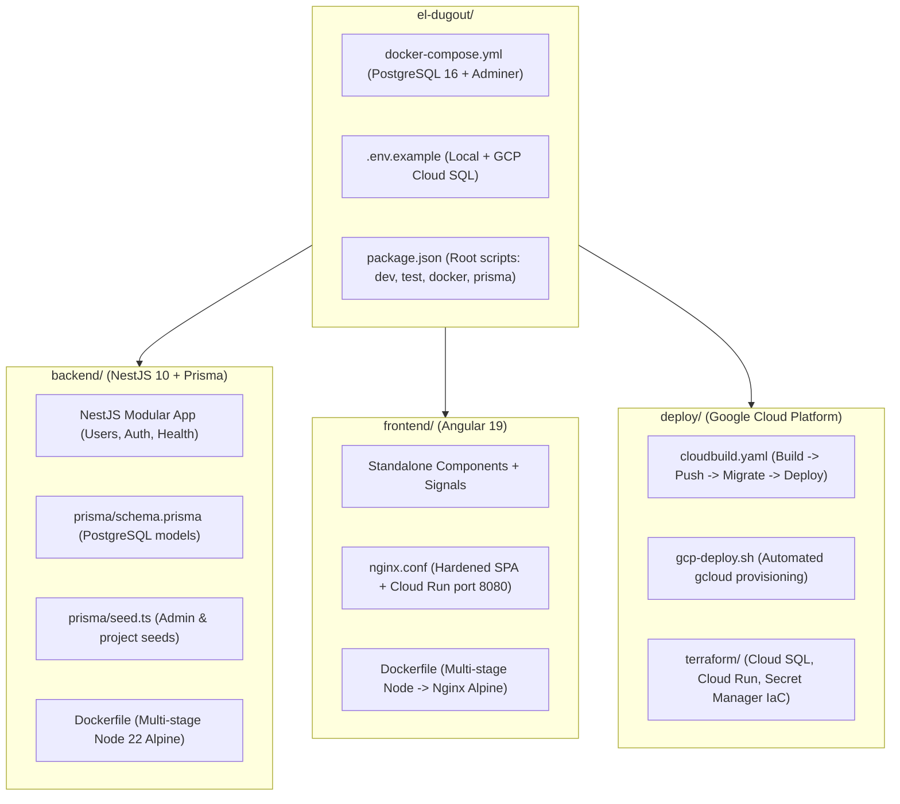

# Walkthrough: El Dugout Ve (Angular + NestJS + PostgreSQL / Google Cloud)

We have created the full architecture and codebase for **El Dugout Ve** (Venezuelan Professional Baseball Wiki) designed for Google Cloud Platform and `eldugoutve.com`.

---

## 🏛 What Was Built



---

## 📁 Summary of Files Created

### 1. Root & Orchestration
- [docker-compose.yml](file:///Users/gabo/repos/el-dugout/docker-compose.yml): Local PostgreSQL 16 Alpine container with healthchecks and Adminer web GUI on `localhost:8081`.
- [.env.example](file:///Users/gabo/repos/el-dugout/.env.example): Complete environment variable template with local Postgres and Google Cloud SQL Unix socket configuration.
- [package.json](file:///Users/gabo/repos/el-dugout/package.json): Root scripts for running backend, frontend, database, prisma, and builds with a single command.
- [.gitignore](file:///Users/gabo/repos/el-dugout/.gitignore): Comprehensive ignores for Node, Angular cache, build outputs, terraform, and secrets.
- [README.md](file:///Users/gabo/repos/el-dugout/README.md): Detailed onboarding and architecture documentation.

### 2. Backend (`backend/`)
- [schema.prisma](file:///Users/gabo/repos/el-dugout/backend/prisma/schema.prisma): PostgreSQL datasource, User and Project relational models with audit timestamps (`createdAt`, `updatedAt`).
- [seed.ts](file:///Users/gabo/repos/el-dugout/backend/prisma/seed.ts): Seed script creating default admin user with hashed password and initial projects.
- [main.ts](file:///Users/gabo/repos/el-dugout/backend/src/main.ts): Bootstrap with Swagger/OpenAPI (`/api/docs`), global validation pipe, CORS, and Cloud Run host binding (`0.0.0.0`).
- [app.module.ts](file:///Users/gabo/repos/el-dugout/backend/src/app.module.ts): Clean modular composition.
- [prisma.service.ts](file:///Users/gabo/repos/el-dugout/backend/src/database/prisma.service.ts): Prisma client lifecycle management and Cloud SQL resilience.
- [health.controller.ts](file:///Users/gabo/repos/el-dugout/backend/src/modules/health/health.controller.ts): Liveness/readiness probe (`/api/health`) checking memory heap and PostgreSQL connectivity.
- [users.controller.ts](file:///Users/gabo/repos/el-dugout/backend/src/modules/users/users.controller.ts) & [users.service.ts](file:///Users/gabo/repos/el-dugout/backend/src/modules/users/users.service.ts): Full CRUD module with DTO validation.
- [auth.controller.ts](file:///Users/gabo/repos/el-dugout/backend/src/modules/auth/auth.controller.ts): Authentication starter with bcrypt verification.
- [Dockerfile](file:///Users/gabo/repos/el-dugout/backend/Dockerfile): Multi-stage slim production build running under an unprivileged user.

### 3. Frontend (`frontend/`)
- [angular.json](file:///Users/gabo/repos/el-dugout/frontend/angular.json): Modern `@angular/build:application` builder configuration.
- [app.config.ts](file:///Users/gabo/repos/el-dugout/frontend/src/app/app.config.ts): Modern standalone configuration with functional HTTP interceptor (`apiInterceptor`).
- [home.component.ts](file:///Users/gabo/repos/el-dugout/frontend/src/app/features/home/home.component.ts): Interactive dashboard with real-time health indicator for NestJS & PostgreSQL.
- [users.component.ts](file:///Users/gabo/repos/el-dugout/frontend/src/app/features/users/users.component.ts): Real-time user management with Angular Signals and CRUD operations.
- [architecture.component.ts](file:///Users/gabo/repos/el-dugout/frontend/src/app/features/architecture/architecture.component.ts): Visual GCP deployment topology diagram and architecture breakdown.
- [nginx.conf](file:///Users/gabo/repos/el-dugout/frontend/nginx.conf): Nginx configuration for Cloud Run with SPA routing fallback and security headers.
- [Dockerfile](file:///Users/gabo/repos/el-dugout/frontend/Dockerfile): Multi-stage Node build -> Nginx Alpine serving container (<25MB).

### 4. Deployment & Google Cloud Platform (`deploy/`)
- [cloudbuild.yaml](file:///Users/gabo/repos/el-dugout/deploy/cloudbuild.yaml): Complete CI/CD pipeline building Docker images, pushing to Google Artifact Registry, and deploying to Cloud Run.
- [gcp-deploy.sh](file:///Users/gabo/repos/el-dugout/deploy/gcp-deploy.sh): Automated `gcloud` provisioning script for Cloud SQL (PostgreSQL 16), Secret Manager, Artifact Registry, and Cloud Run.
- [terraform/](file:///Users/gabo/repos/el-dugout/deploy/terraform/): Complete Terraform configuration for Infrastructure as Code.

---

## ⚡ Next Steps in Your Terminal

Run the following commands in your terminal:

### 1. Backend Setup & Verification
```bash
cd /Users/gabo/repos/el-dugout/backend
npm install
npx prisma generate
npm run build
npm test
```

### 2. Frontend Setup & Verification
```bash
cd /Users/gabo/repos/el-dugout/frontend
npm install
npm run build
```

### 3. Launch Local Stack
From the project root (`/Users/gabo/repos/el-dugout`):
```bash
# Start PostgreSQL & Adminer
npm run docker:db

# Run migrations and seed database
npm run prisma:migrate
npm run prisma:seed

# Start backend (http://localhost:3000/api/docs)
npm run dev:backend

# Start frontend (http://localhost:4200)
npm run dev:frontend
```
